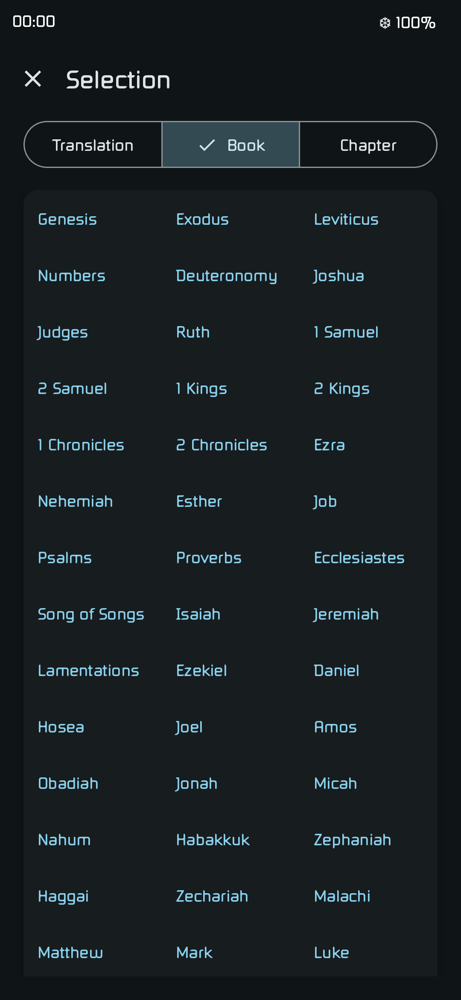
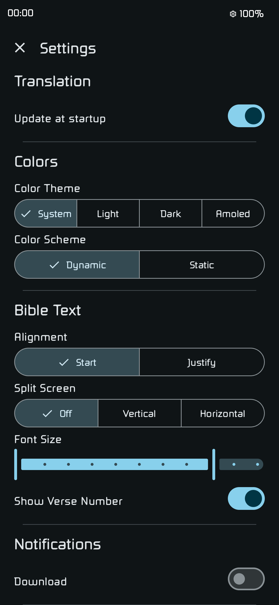

# OpenBible

[German](./README_DE.md)

<!-- ./fastlane/metadata/android/en-US/short_description.txt -->
OpenBible provides the Bible as a simple Android App

## Description
<!-- ./fastlane/metadata/android/en-US/full_description.txt -->

<i>OpenBible</i> lets you download the Bible in multiple translations. You can choose a downloaded translation and select a book and chapter of it. Then you can read the selected chapter. If you exit out of the app, it saves your last state that you can continue, where you left. It follows your system theme (dark/light mode, language and material design) to make your experience as simple and straight forward as possible.

## How does it work?
It is written in [Jetpack Compose](https://developer.android.com/compose) and uses [Material You](https://m3.material.io) as its Design.
It downloads and works with json files, provided by the [GETBIBLE API](https://getbible.net/docs) and the [CrossWire SWORD](https://www.crosswire.org/sword) project.

## Screenshots
|  |  |  |
|-----------------------------------------------------------------------|-----------------------------------------------------------------------|-----------------------------------------------------------------------|
